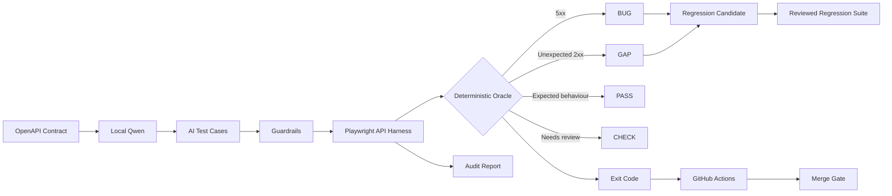
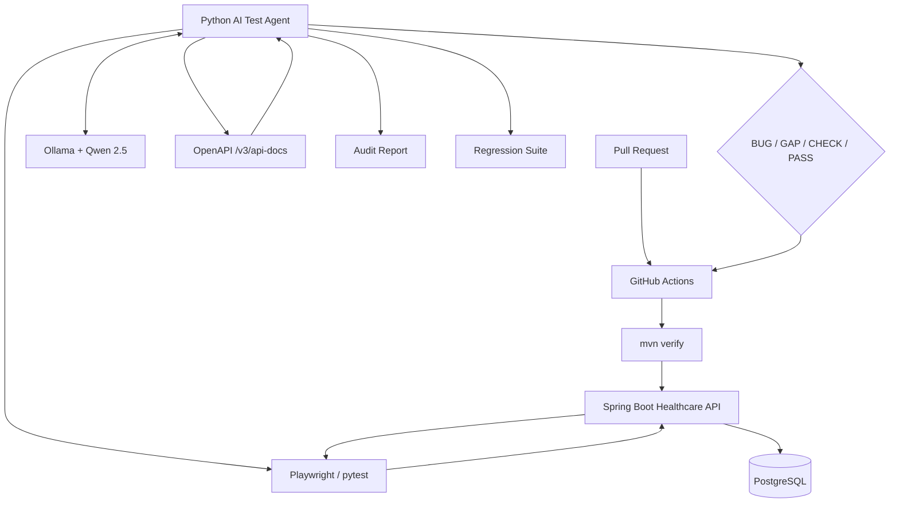
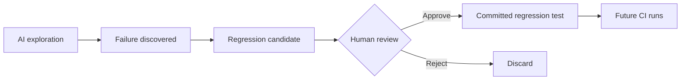
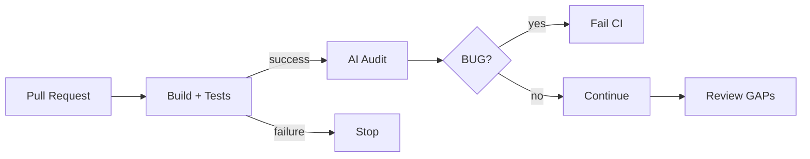

# MediTest-AI

<p align="center">
  <strong>Self-hosted AI Quality Gate for Healthcare APIs</strong><br>
  A local LLM explores API edge cases; deterministic tests decide whether the build is safe.
</p>

<p align="center">
  <a href="#how-it-works">How it works</a> ·
  <a href="#architecture">Architecture</a> ·
  <a href="#quick-start">Quick start</a> ·
  <a href="#design-principles">Design principles</a> ·
  <a href="#roadmap">Roadmap</a>
</p>

> **The LLM proposes. Playwright executes. Deterministic rules decide.**

MediTest-AI is an open-source, self-hosted experiment in **AI-assisted quality engineering for healthcare APIs**. It reads a Spring Boot API's OpenAPI contract, asks a locally hosted Qwen model to propose edge cases, validates those cases with guardrails, executes them through a fixed Playwright/pytest harness, and turns the observed responses into deterministic **BUG / GAP / CHECK / PASS** verdicts.

No patient data needs to leave the local environment and the workflow does not require an external LLM API key.

---

## 🎮 Interactive project walkthrough

**[Open the interactive architecture demo →](docs/interactive-demo.html)**

The demo walks through the seven stages:

```text
01  Discover   → OpenAPI contract
02  Think      → Local Qwen inference
03  Validate   → Guardrails
04  Execute    → Playwright
05  Decide     → Deterministic verdict
06  Learn      → Regression candidates
07  Gate       → GitHub Actions
```

For GitHub itself, the same story is represented below using GitHub-compatible Mermaid.

---

## Why build this?

Traditional API testing is excellent at checking the cases engineers already thought about.

The harder problem is discovering the **uncomfortable cases**:

- What happens when a field is missing?
- What happens when an ID does not exist?
- What happens when a date is impossible?
- What happens when an unexpected input reaches business logic?
- Does invalid client input become a clean `4xx`, or does the server crash with `500`?

MediTest-AI explores those cases with a local LLM while keeping the actual execution and pass/fail decision deterministic.

The goal is not:

> "Let an LLM decide whether my API is good."

The goal is:

> **Use an LLM to expand test exploration while keeping software engineering controls around execution and verdicts.**

---

## How it works



### The seven-stage loop

| Stage | What happens | Why it matters |
|---|---|---|
| **01 — Discover** | Agent reads `/v3/api-docs` | Grounds exploration in the real API |
| **02 — Think** | Qwen proposes edge cases | Expands beyond hand-written tests |
| **03 — Validate** | Guardrails check method/path/expectation | Prevents the model from inventing arbitrary API calls |
| **04 — Execute** | Playwright sends the cases | A fixed harness controls execution |
| **05 — Decide** | Rules classify the result | The LLM does not own pass/fail |
| **06 — Learn** | Reviewed findings become regressions | Discoveries become deterministic protection |
| **07 — Gate** | CI consumes the exit code | Crashes can block a merge |

---

## Architecture



### Core engineering boundary

```text
                  ┌─────────────────────────────┐
                  │          LOCAL QWEN          │
                  │                             │
                  │     "What should we test?"  │
                  └──────────────┬──────────────┘
                                 │
                          proposes JSON
                                 │
                                 ▼
                  ┌─────────────────────────────┐
                  │       FIXED HARNESS         │
                  │                             │
                  │      Playwright + pytest    │
                  │                             │
                  │       "Execute this."       │
                  └──────────────┬──────────────┘
                                 │
                                 ▼
                  ┌─────────────────────────────┐
                  │     DETERMINISTIC ORACLE    │
                  │                             │
                  │       "What happened?"      │
                  └─────────────────────────────┘
```

**The model produces test data, not executable test code.**

---

## What the agent can discover

The project deliberately includes failure modes that make the quality-gate concept visible.

### Example 1 — Server crash

```text
POST /api/patients
        │
        │ missing bloodType
        ▼
PatientService
        │
        │ unsafe null handling
        ▼
NullPointerException
        │
        ▼
HTTP 500
        │
        ▼
🔴 BUG
```

A client-input problem should not become an unexpected server crash.

### Example 2 — Validation gap

```text
POST /api/patients
        │
        │ DOB = future date
        ▼
API accepts request
        │
        ▼
HTTP 201
        │
        ▼
⚠ GAP
```

The distinction matters:

- **BUG** = the service crashes / produces a server error.
- **GAP** = the API accepts something that should have been rejected.
- **PASS** = observed behaviour matches the case's expectation.
- **CHECK** = the result needs human review rather than an automatic failure.

---

## Deterministic verdicts

The current audit logic intentionally keeps the oracle simple.

```text
response.status >= 500
        ↓
      BUG

expected 4xx
     +
actual 2xx
        ↓
      GAP

expected 2xx
     +
actual >= 400
        ↓
     CHECK

otherwise
        ↓
      PASS
```

This is important because LLM output is probabilistic.

The **model can vary**.

The **quality gate should not silently vary with the model's wording**.

---

## Regression learning

A useful discovery should not disappear after one run.



This creates a useful feedback loop:

```text
Exploration
    ↓
Discovery
    ↓
Human review
    ↓
Regression
    ↓
Deterministic protection
```

---

## Technology

| Layer | Technology |
|---|---|
| API | Java 17 · Spring Boot 3 |
| Persistence | Spring Data JPA · Hibernate · PostgreSQL |
| API contract | OpenAPI / Springdoc |
| AI agent | Python |
| Local LLM | Ollama · Qwen 2.5 |
| API execution | Playwright |
| Test runner | pytest |
| Packaging/runtime | Docker / Compose |
| CI | GitHub Actions |

---

## Repository structure

```text
meditest-ai/
│
├── healthcare-api/
│   └── src/main/java/
│       └── com/meditest/
│           ├── patient/
│           └── appointment/
│
├── agent/
│   ├── agent.py
│   ├── test_audit.py
│   ├── regression_cases.json
│   └── requirements.txt
│
├── docs/
│   └── interactive-demo.html
│
├── .gitignore
└── README.md
```

---

## Quick start

### 1. Start the local infrastructure

Start the Spring Boot API and PostgreSQL using your preferred local setup. The agent expects the API at `http://localhost:8080` by default.

The intended architecture is:

```text
Docker / Colima
       │
       ├── PostgreSQL
       │
       └── Healthcare API
                │
                └── /v3/api-docs
```

### 2. Start Ollama

Pull a local model:

```bash
ollama pull qwen2.5:7b
```

For a lighter local/CI run:

```bash
ollama pull qwen2.5:1.5b
```

### 3. Install the agent dependencies

```bash

python -m venv .venv
source .venv/bin/activate
pip install -r agent/requirements.txt
```

### 4. Run the AI audit

From the repository root:

```bash
LLM_MODEL=qwen2.5:1.5b python agent/agent.py
```

The agent:

```text
waits for API
     ↓
downloads OpenAPI
     ↓
asks local Qwen for cases
     ↓
applies guardrails
     ↓
runs Playwright
     ↓
classifies results
     ↓
writes report
     ↓
returns CI exit code
```

### 5. Review the report

The agent writes:

```text
reports/report.md
reports/regression_candidates.json
```

Review candidates before promoting them:

```bash
python agent/agent.py --promote
```

---

## CI philosophy

The quality gate is intentionally designed around a cheap deterministic build first.



The important property is that the AI audit does not replace the normal software build/test pipeline.

It sits **after** the basic build/test stage and adds exploratory quality checks.

---

## Security / privacy model

The intended model is self-hosted:

```text
Healthcare API
      │
      ▼
OpenAPI contract
      │
      ▼
Local Python agent
      │
      ▼
Local Ollama
      │
      ▼
Local Qwen
```

There is no requirement for a hosted LLM API key in the core workflow.

For healthcare-related systems, this matters because the architecture can keep test information inside the environment rather than automatically sending it to an external model provider.

**Important:** this project is an engineering prototype, not a claim of regulatory compliance or production clinical safety.

---

## Design decisions

### 1. Model proposes; code decides

The LLM is useful for exploration, but deterministic software controls the verdict.

### 2. The model does not write executable tests

The model returns structured test-case data.

A reviewed Playwright harness executes those cases.

### 3. OpenAPI is the grounding layer

The agent starts from the API's machine-readable contract instead of asking the model to guess what endpoints exist.

### 4. Exploration and regression are different

```text
AI exploration
     ↓
variable / probabilistic
     ↓
discover something
     ↓
human review
     ↓
regression
     ↓
deterministic
```

### 5. Local inference is part of the engineering design

Self-hosting is not only about cost.

It also reduces dependence on external secrets and makes the architecture suitable for CI environments where sending test data to a third-party model may be undesirable.

---

## What this project demonstrates

This project intentionally connects several engineering disciplines:

```text
Java
  +
Spring Boot
  +
REST APIs
  +
OpenAPI
  +
PostgreSQL
  +
Python
  +
Playwright
  +
LLMs
  +
Agentic workflows
  +
CI/CD
  +
Quality Engineering
```

That combination is the point.

It is not simply:

> "I called an LLM API."

It is an attempt to build a controlled **AI-assisted engineering system** around a real software lifecycle.

---

## Current limitations

This version deliberately keeps the oracle narrow.

Current focus:

- server crashes / `5xx`
- validation-style gaps
- deterministic execution
- regression candidates
- OpenAPI-grounded exploration

Planned improvements include:

- response-schema validation
- authentication-aware testing
- broader security testing
- Testcontainers
- richer API contracts
- multi-service OpenAPI/RAG workflows
- stronger CI model strategies

The project manual explicitly recommends measuring detection rate, false positives, pipeline time and cost rather than inventing performance numbers. fileciteturn14file4

---

## Roadmap

```text
[x] Spring Boot healthcare API
[x] PostgreSQL
[x] OpenAPI contract
[x] Local Qwen inference
[x] AI-generated API cases
[x] Guardrails
[x] Playwright execution
[x] Deterministic BUG/GAP/PASS logic
[x] Regression candidates
[x] GitHub Actions direction

[ ] Response schema validation
[ ] Authentication-aware exploration
[ ] Testcontainers
[ ] Multi-service contract discovery
[ ] Stronger regression promotion workflow
[ ] Measured benchmark suite
[ ] Public demo video
```

---

## Why this project is interesting to me

I'm using MediTest-AI to explore the intersection of:

**Quality Engineering × Backend Engineering × LLMs × Agentic AI × CI/CD**

The larger question is:

> **How do we use probabilistic AI inside software engineering without making the engineering process itself probabilistic?**

MediTest-AI is my attempt at one answer:

```text
AI for exploration
+
Software for control
+
Humans for review
+
CI for enforcement
```

---

## License

Open-source project. See the repository license for the applicable terms.
